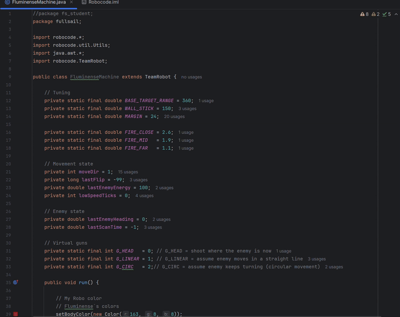

# Robocode AI Battle Bot – Virtual Guns Champion

Within my college I had the privilege of participating in a Robocode tournament, which I came out as champion

---

## 🏆 Competition Result  
My robot finished **1st place ** 

---

## 🎮 Videos

---

## 🤖 Robot Behavior Overview

### Radar
- Keeps the radar locked on the enemy using continuous rotation with overshoot.
- Ensures frequent scans and up-to-date enemy data.

### Movement
- Uses **orbit movement**, staying perpendicular to the enemy instead of charging directly.
- Adjusts distance dynamically depending on how close or far the enemy is.
- Includes wall avoidance and a simple anti-stuck mechanism.
- Detects enemy shots by monitoring energy drops and changes direction to dodge bullets.

### Targeting System (Virtual Guns)
The robot uses multiple aiming strategies and chooses the best one depending on the enemy’s movement:

- **Head-On Targeting**  
  Shoots directly at the enemy’s current position.

- **Linear Targeting**  
  Predicts where the enemy will be if it keeps moving in a straight line.

- **Circular Targeting**  
  Predicts curved movement by tracking the enemy’s turn rate over time.

A lightweight accuracy tracking system (virtual guns) is used to favor the targeting method that performs best during the battle.

### Fire Control
- Bullet power changes based on distance and current energy.
- Stronger shots at close range, weaker shots at long range.
- Reduced fire power when energy is low to avoid unnecessary risk.

## 🛠 Technologies Used
- **Java**
- **Robocode API**
- IntelliJ IDEA
- Predictive math (linear and circular interception)
- Basic AI decision logic
- Geometry and vector math

---

## 📌 Notes
The original project environment is no longer available.  

---

👤 **Author:** Valenco Silva  

